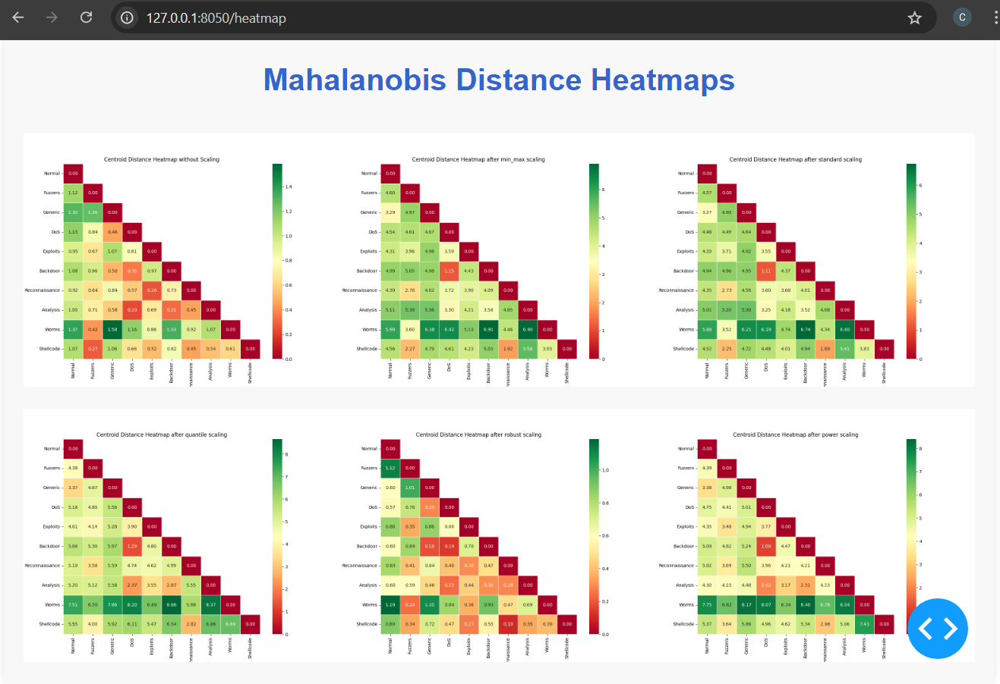
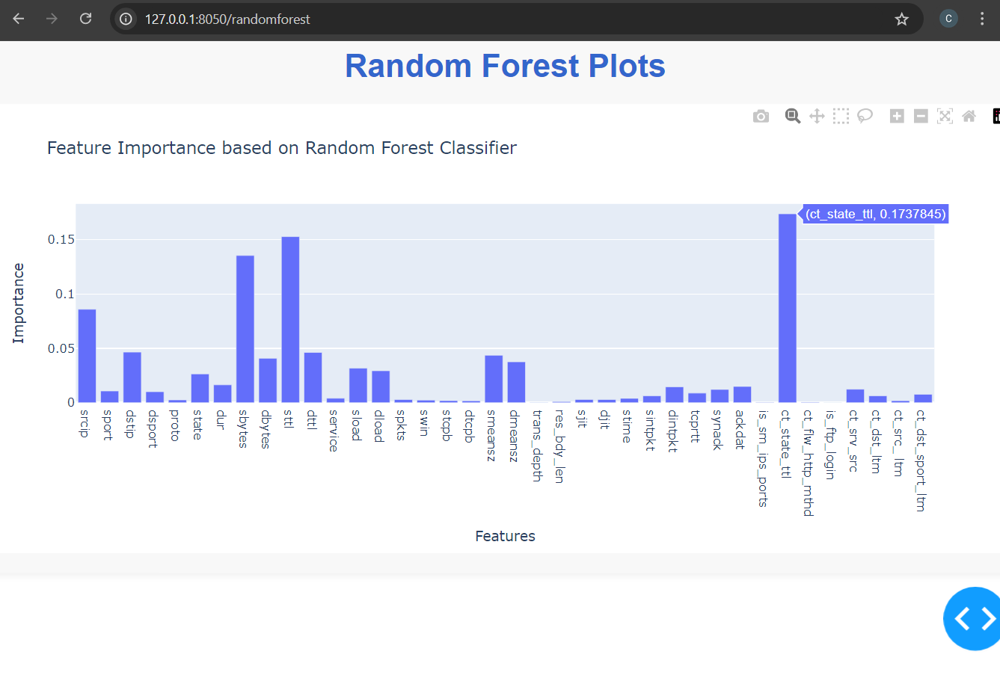
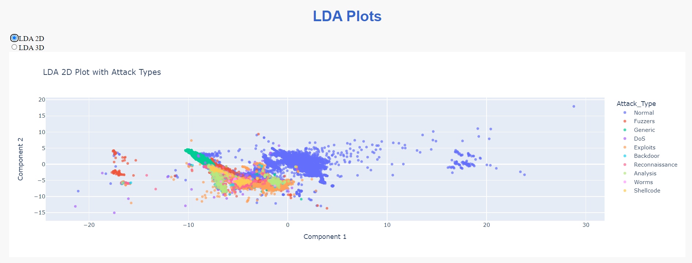

<p align="center"> 
    </img>
</p>

<h1 align="center"> NetViz 📊🔐</h1> 
<h3 align="center"> Unveiling network security through powerful visual analytics and insights.</h3>

<p align="center">
    <a href="https://pandas.pydata.org/"></a>
    <a href="https://plotly.com/"></a>
    <a href="https://scikit-learn.org/stable/"></a>
    <a href="https://dash.plotly.com/"></a>
    <a href="https://numpy.org/"></a>
    <a href="https://seaborn.pydata.org/"></a>
    <a href="https://matplotlib.org/"></a>
    <a href="https://tqdm.github.io/"></a>
</p>

<!-- <p align="center">If you want to discuss something, you can ask on my <a href="https://discord.com/invite/GkcbM5bwZr">Discord Server</a>.</p> -->

# 🖥️ Installation & Setup ⚙️

## Pre-requisites

- Anaconda : Ensure that Anaconda is installed on your computer. Download from [Anaconda](https://www.anaconda.com/download)  
  check the installation by running the following command in the terminal:

  ```
  conda
  ```

  **Note:** In windws, you have to use Anaconda Prompt to run the above command and use conda commands

- Visual Studio Code : Ensure that Visual Studio Code is installed on your computer. Download from [VS Code](https://code.visualstudio.com/download)

## Creating a new environment

1. Creating a Conda Environment  
   Open your terminal (or Anaconda Prompt for Windows users) and execute the following command to create a new Conda environment. Replace env_name with your preferred name for the environment.

   ```bash
   conda create --name env_name python
   ```

2. Activating the Environment  
   Activate the newly created environment by running:

   ```bash
   conda activate env_name
   ```

3. Installing Packages 🛠️  
   Install the required packages using the following commands (make sure you are in the activated environment step 2.)

   ```bash
   pip install pandas plotly scikit-learn dash numpy seaborn matplotlib tqdm
   ```

## Running the code in VS Code (Any other IDE)

1. **Open the Project**

   - Open the project directory in Visual Studio Code by selecting open folder from the file menu. Make sure you are in the root directory of the project soruce code which contains the README.md file.

2. **Selecting the Python Interpreter/kernel from the environment created now.**

   - Ensure that VS Code uses the Python interpreter from this Conda environment:

   - Open a Python or Notebook file.
     Click on the Python version in the status bar at the bottom or use Ctrl+Shift+P/Cmd+Shift+P and search for "Python: Select Interpreter".

   - Choose the interpreter from the "env_name" environment.
   - Run this command

   ```
   python project_final.py
   ```

- The dashboard starts running in localhost 8050. Open the browser and type http://localhost:8050/ to view the dashboard.

3. **Running Jupyter Notebooks**

   - To run a Jupyter Notebook:

   - Open the .ipynb file.
     Execute cells individually or run the entire notebook using the play button.

# Dataset 🗃️

The **UNSW-NB15** dataset is a comprehensive and modern computer network security dataset released in 2015 by the University of New South Wales. It contains realistic normal and abnormal network activities that are vital for research in network intrusion detection. The dataset is widely used for developing and testing machine learning models for cybersecurity applications.

## Key Features:

- **Total Records**: 2,540,044 instances.
- **Features**: 49 features, including 47 non-target features and 2 target features (label, attack_cat).
- **Attack Categories**: 10 different types of attacks including Normal, Generic, Exploits, Fuzzers, DoS, Reconnaissance, Backdoor, Shellcode, Worms, and Analysis.
- **Data Types**: The dataset includes basic, content, time, and general-purpose features derived from network flow records.

## Challenges:

- **Class Imbalance**: The dataset shows a significant imbalance, with 87% of instances belonging to the "Normal" category.
- **Class Overlap**: There is a considerable overlap between some attack classes, making accurate classification challenging.

## Access the Dataset

The dataset is publicly available for download from the official UNSW website. You can access it [here](https://research.unsw.edu.au/projects/unsw-nb15-dataset).

# 📊 Results

## 1. **Class Imbalances**

- The **bar charts** highlight significant class imbalances in the UNSW-NB15 dataset, with the "Normal" attack class dominating at 87%.


### 2. **Heatmap Visualization**

- The **Mahalanobis Distance Heatmap** effectively showcases the distances between class centroids after applying different scaling techniques, helping to visualize class separations and overlaps.
- The heatmap revealed that **min-max scaling** improved separation between classes, reducing overlap, while **standard scaling** still exhibited some overlap.



## 3. **Feature Selection**

- The **Elastic Net Algorithm** identified 25 important features, significantly improving visualization clarity.
  
  

- **Random Forest** selected 35 features, though it included some less relevant ones, making Elastic Net the preferred method.
  

## 4. **Dimensionality Reduction**

- **PCA**: Visualized class overlaps in 2D and 3D, revealing significant overlaps in attack classes.
  
  
- **t-SNE**: Provided finer details, effectively showing the clustering of similar instances in the dataset.
  
- **LDA**: Revealed cluttered attack class distributions, confirming the presence of overlaps.
  
  

## 5. **Cluster Analysis**

- **K-means Intercluster Distance Map**: Demonstrated that certain attack classes (e.g., "Fuzzers") completely overlap with "Normal," indicating poor separation between classes.
  

## 6. **Visualization Dashboard**

- The dashboard integrates all visualizations, allowing for interactive exploration of class imbalances, overlaps, and feature importance.
- This comprehensive visual tool aids in understanding the dataset's challenges before model development.
  
  

# 🚀 Technical Details

## High-Level Architecture


## Methodology

The "NetViz" project follows a structured approach to visualize and analyze network intrusions using the UNSW-NB15 dataset. The methodology consists of several key steps:

### 1. **Data Acquisition and Cleaning**

- **Data Collection**: The UNSW-NB15 dataset was obtained and consolidated from multiple CSV files into a single dataset for analysis.
- **Data Cleaning**: Removed missing values and unnecessary columns, ensuring the dataset was clean and ready for processing.

### 2. **Data Preprocessing**

- **Label Encoding**: Nominal features were converted into numerical values using label encoding, except for the target column (`attack_cat`).
- **Feature Scaling**: Applied various scaling techniques, including min-max scaling, robust scaling, and standard scaling, to normalize the dataset. This step was critical for ensuring consistency across feature values.

### 3. **Feature Selection**

- **Elastic Net Algorithm**: Used to select the most important features by minimizing the impact of redundant and irrelevant features. This method helped to reduce complexity and improve visualization clarity.
- **Random Forest Algorithm**: Employed as an alternative feature selection method, but found to be less effective due to the inclusion of unnecessary features.

### 4. **Dimensionality Reduction**

- **Principal Component Analysis (PCA)**: Implemented to reduce the dimensionality of the dataset and visualize the data in 2D and 3D. PCA helped in identifying significant overlaps among different attack classes.
- **Linear Discriminant Analysis (LDA)**: Applied to enhance the separation between different classes, particularly in 2D and 3D visualizations, though it revealed some cluttered distributions.
- **t-SNE (t-Distributed Stochastic Neighbor Embedding)**: Used for capturing finer details in the data, showing how similar instances cluster together.

### 5. **Heatmap Visualization**

- **Mahalanobis Distance Heatmap**: Created to visualize the distances between class centroids after applying different scaling techniques. This helped in identifying class separations and overlaps.

### 6. **Cluster Analysis**

- **K-means Clustering**: Performed to analyze the inter-cluster distances, revealing significant overlaps between certain attack classes, particularly between "Fuzzers" and "Normal."

### 7. **Dashboard Development**

- **Interactive Dashboard**: Developed using Plotly Dash to integrate all visualizations into a single interactive platform. The dashboard provides comprehensive insights into class imbalances, feature importance, and cluster distributions.

### 8. **Evaluation and Conclusion**

- **Analysis of Results**: The visualizations and analyses were evaluated to uncover critical issues such as class imbalances and overlaps, which are essential for improving network intrusion detection models.
- **Final Insights**: Conclusions were drawn based on the effectiveness of the visualizations and the identified challenges in the dataset.

This methodology ensures a thorough exploration of the dataset, providing valuable insights that contribute to the development of more robust network intrusion detection systems.

# Contributors 

<table>
  <tbody>
    <tr>
      <td align="center">
        <a href="https://github.com/charangajjala" target="_blank">
          
          <br />
          <sub><b>Charan Gajjala Chenchu</b></sub>
        </a>
      </td>
      <td align="center">
        <a href="https://github.com/kalluri14"
          target="_blank">
          
          <br />
          <sub><b>Divija Kalluri</b></sub>
        </a>
      </td>
  </tbody>
</table>

# 🎟️ License

This project is licensed under the MIT License - see the [License](LICENSE) file for details.

# 📜 References & Acknowledgement

1. **Stahnke, J., Dork, M., Müller, B., & Thom, A.** (2016). Probing Projections: Interaction Techniques for Interpreting Arrangements and Errors of Dimensionality Reductions. _IEEE Transactions on Visualization and Computer Graphics_, 22(1), 629–638. [https://doi.org/10.1109/TVCG.2015.2467717](https://doi.org/10.1109/TVCG.2015.2467717)

2. **Janarthanan, T., & Zargari, S.** (2017). Feature selection in UNSW-NB15 and KDDCUP'99 datasets. _IEEE Xplore_, June 2017. [https://ieeexplore.ieee.org/abstract/document/8001537](https://ieeexplore.ieee.org/abstract/document/8001537)

3. **Kanimozhi, V., & Jacob, P.** (2019). UNSW-NB15 dataset feature selection and network intrusion detection using deep learning. _International Journal of Recent Technology and Engineering_, 7, 443-446.

4. **van der Maaten, L., & Hinton, G.** (2008). Visualizing data using t-SNE. _Journal of Machine Learning Research_, 9, 2579-2605.

5. **Zoghi, Z., & Serpen, G.** (2021). UNSW-NB15 Computer Security Dataset: Analysis through Visualization.

6. **Moustafa, N., & Slay, J.** (2015). UNSW-NB15: a comprehensive data set for network intrusion detection systems (UNSW-NB15 network data set). _Military Communications and Information Systems Conference (MilCIS)_, 2015. [https://research.unsw.edu.au/projects/unsw-nb15-dataset](https://research.unsw.edu.au/projects/unsw-nb15-dataset)

7. **Pedregosa, F., et al.** (2011). Scikit-learn: Machine Learning in Python. _Journal of Machine Learning Research_, 12, 2825-2830.

8. **Hunter, J. D.** (2007). Matplotlib: A 2D Graphics Environment. _Computing in Science & Engineering_, 9(3), 90-95.

9. **McKinney, W.** (2010). Data Structures for Statistical Computing in Python. _Proceedings of the 9th Python in Science Conference_, 51-56.

10. **Oliphant, T. E.** (2006). A Guide to NumPy. _Trelgol Publishing_.

11. **Seaborn: Statistical Data Visualization**. (n.d.). Retrieved from [https://seaborn.pydata.org](https://seaborn.pydata.org)

12. **TQDM: A Fast, Extensible Progress Bar for Python and CLI**. (n.d.). Retrieved from [https://tqdm.github.io](https://tqdm.github.io)
